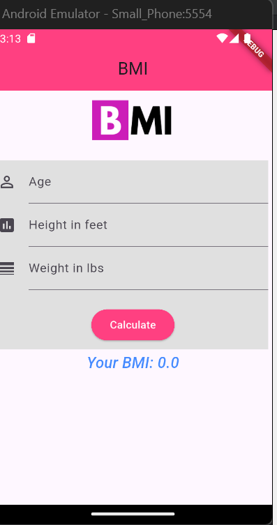
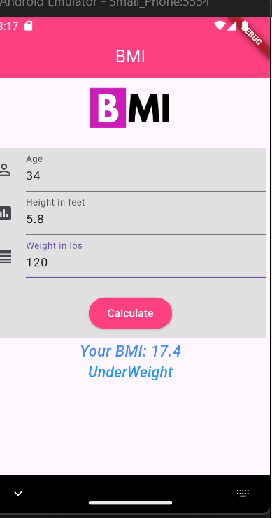
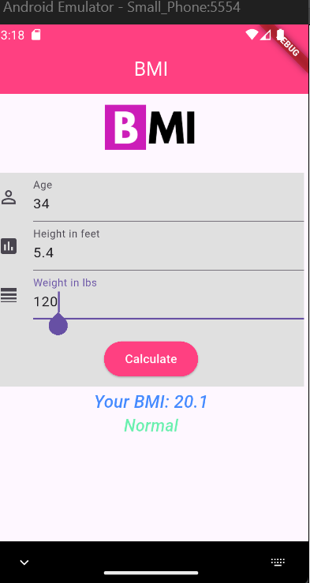
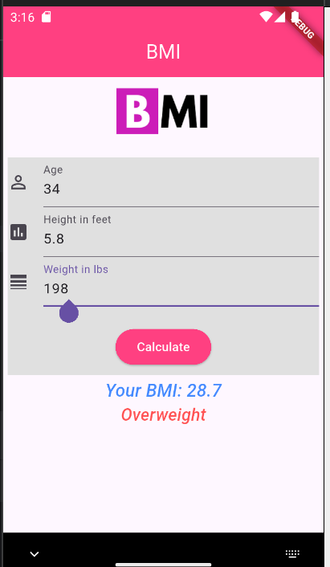
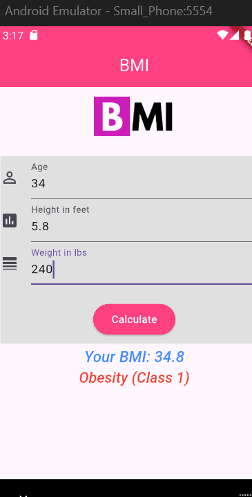

# BMI App (Flutter)

A simple **BMI (Body Mass Index) Calculator** app built with **Flutter**. This app allows users to calculate their BMI based on their **age**, **height (in feet)**, and **weight (in lbs)**. The result displays the BMI value along with a health category and color-coded feedback.

---

## Features

- Input **Age**, **Height (feet)**, and **Weight (lbs)**.
- Calculates **BMI** using the formula:
- BMI = (Weight in lbs / (Height in inches)^2) * 703
- Displays **BMI value** and **health category**:
- Underweight
- Normal
- Overweight
- Obesity (Class 1)
- Obesity (Class 2)
- Obesity (Class 3 – Severe)
- Color-coded results for easy visualization.

---

## Screenshots








---


### Prerequisites

- Flutter SDK installed ([Installation Guide](https://flutter.dev/docs/get-started/install))
- Dart SDK
- An IDE such as **Android Studio**, **VS Code**, or **IntelliJ IDEA**

---

### Installation

1. Clone the repository:

```bash
git clone https://github.com/abdulazizpatwary/BMI_Apps.git


